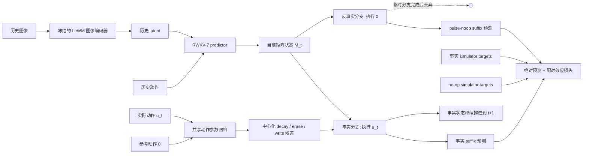

# RWKV-WM

**面向长期 imagination 的逐时间位置配对反事实 RWKV 世界模型。**

本项目研究一个受限但关键的问题：给定真实观察历史和未来动作序列后，在接下来的多步内不再读取真实世界观察，世界模型能否仅依靠内部状态持续生成高保真的 latent rollout？当前方法不改动动作规划器，而是把研究重点放在世界模型 predictor 的长期递推能力上。

核心方案使用带矩阵状态的 RWKV-7 替换 Transformer predictor，并在真实行为轨迹的**每一个时间位置**构造 factual / pulse-noop 配对分支。模型既要预测环境在零动作下的自主变化，也要学习当前动作引起的即时、延迟和长期效应如何写入 RWKV 矩阵并随递推传播。

> 当前正式实验仍在进行。本仓库提供方法实现、数据采集与审计、训练和评估代码，但不预先声称该方法已经优于所有基线。

## 研究问题

普通一步预测训练不能直接保证长程 rollout 稳定。误差会在 free-running 推理中累积，而动作作用、环境漂移、惯性和历史效应也容易被模型混合在同一个表示中。只比较一条真实轨迹和一条从起点开始的全零轨迹，又会改变整个未来动作分布，无法定位某一个动作的因果贡献。

本项目将问题拆成两部分：

- **world/reference dynamics**：没有当前动作干预时，环境自身、历史动作、漂移和惯性造成的状态变化；
- **action effect**：在相同历史、相同状态和相同外部随机条件下，仅替换当前动作后产生并向未来传播的差异。

目标不是让模型只关注动作，而是同时学好绝对世界演化和动作条件效应。

## 整体方法



### 1. 冻结视觉表示

图像通过官方 LeWM/JEPA encoder 转换为 latent。当前实验冻结 encoder，只训练 latent predictor，从而把比较集中在序列建模和矩阵递推上。

### 2. Stateful RWKV-7 predictor

项目包含手工实现的 PyTorch RWKV-7/x070 block，并用独立矩阵 oracle 测试其 generalized delta-rule、状态方向和零干预退化性质。每层维护：

- RWKV 矩阵状态；
- TimeMix shift state；
- ChannelMix shift state。

历史 latent 和动作首先被消费为持久状态，之后模型在没有新观察的情况下递归使用自己的预测结果。语言模型预训练权重不会直接复用，因为这里的输入是连续视觉 latent 和连续控制动作。

### 3. 逐时间位置的配对反事实数据

设数据集的真实动作 suffix 为：

```text
factual:    [u_t, u_{t+1}, ..., u_{H-1}]
pulse-noop: [  0, u_{t+1}, ..., u_{H-1}]
```

对轨迹中的每个位置 `t`，两个分支都从完全相同的 simulator snapshot、RWKV 历史状态和外部噪声开始。pulse-noop 只把当前位置动作替换为环境原始动作空间中的合法零动作，后续仍执行相同的真实动作 suffix。

这不是一条“全零动作轨迹”。factual 主轨迹始终沿数据集动作推进；每个 no-op 分支只是一次临时局部干预，用完即丢弃。由此可同时得到：

- factual 绝对未来状态；
- pulse-noop 绝对未来状态；
- 两者之差形成的即时及长期 effect target；
- 覆盖所有有效 `(intervention position, future offset)` 的三角 mask。

### 4. 反事实中心化矩阵更新

原始 RWKV-7 矩阵递推保留 world decay、generalized erase 和 `value-key` write。提出的方法另外让同一个动作参数网络分别处理实际动作 `u_t` 和参考动作 `0`，再取参数差：

```text
action residual = f(world_t, u_t) - f(world_t, 0)
```

该残差只进入矩阵更新中的三处：

- **centered decay**：在官方 decay 的 log-hazard 参数化上调节记忆保留率；
- **action erase**：增加一个动作条件的低秩擦除方向；
- **action write**：增加一个动作条件的低秩写入方向。

概念上的更新为：

```text
M_{t+1} = world_decay(M_t)
          + world_erase/write
          + centered_action_erase/write
```

当 `u_t = 0` 时，中心化动作残差严格为零，模型退化到 RWKV 的 world update。原始动作不能绕过矩阵直接送入 prediction head，因此长期动作效应必须通过更新后的 recurrent state 保留。

### 5. 多步训练目标

默认训练是 free-running：除起始 latent 外，后续输入使用模型自己的预测，不重新注入真实未来 latent。损失包括：

- `factual_prediction`：事实轨迹的绝对 rollout 误差；
- `noop_prediction`：所有 pulse-noop suffix 的绝对 rollout 误差；
- `paired_effect`：预测的 factual/no-op 差值与 simulator effect target 的误差；
- `effect_direction`：显著 effect 的方向一致性；
- `effect_magnitude`：显著 effect 的尺度一致性。

当前实现的总损失为：

```text
L = L_factual + L_noop
    + lambda_effect * (L_effect + 0.1 L_direction + 0.1 L_magnitude)
```

所有 no-op/effect 项均使用三角 mask，只统计有效未来位置。训练采用由短到长的 horizon curriculum，teacher forcing 仅用于诊断，不作为正式长期 rollout 的默认设置。

## 为什么该设计可能改善长期 imagination

这套设计提供的是可检验机制，而不是理论上必然有效的保证：

1. RWKV 矩阵为长历史提供固定大小、可持续递推的状态；
2. factual 和 no-op 的绝对监督阻止模型为了突出动作而忽略环境自主变化；
3. 同 snapshot、同噪声、同未来动作的局部干预减少动作 effect 标签中的混杂因素；
4. 每个位置都进行配对，而不是只监督第一步，使模型学习动作效应在不同历史状态下如何进入矩阵；
5. 完整 suffix 监督不仅约束即时 effect，还约束其延迟出现、传播和消退；
6. free-running 训练和评估直接暴露误差累积，而不是用 teacher forcing 掩盖长期不稳定。

最终是否有效必须由多随机种子、相同数据预算的长程 rollout 实验决定。

## 实验任务

| 任务 | 关键机制 | 当前 horizon 口径 | 要检验的问题 |
|---|---|---:|---|
| `TwoRoom-W` | TwoRoom 图像导航叠加 episode-constant hidden drift | 4 model steps = 20 primitive steps | 模型能否同时保留环境漂移和动作贡献 |
| `Action-Delay-5` | 动作经长度为 5 的 FIFO 延迟执行 | 20 model/primitive steps | 当前动作尚未生效时，模型能否把其 effect 保存在状态中并在正确时刻显现 |

Action-Delay snapshot 包含 FIFO、pointer 和历史动作；TwoRoom-W snapshot 包含 drift 及其随机状态。数据审计会检查 snapshot 恢复、factual 重放、原始零动作、后缀一致性、effect 对齐以及 episode-level split 隔离。

## 对比方法

| ID | 方法 | 新增 rank-two 动作更新 | 反事实中心化 | paired-effect loss |
|---|---|---:|---:|---:|
| B0 | 原始 Transformer/LeWM predictor | 否 | 否 | 否 |
| B2 | vanilla RWKV-7 predictor | 否 | 否 | 否 |
| B3 | DWM-RWKV paper-spec 输出级基线 | 否 | 输出级 world/action 约束 | 否 |
| B4 | 与 B6 容量匹配的 uncentered rank-two RWKV | 是 | 否 | 否 |
| B6 | 本项目的 per-step paired centered RWKV | 是 | 是 | 是 |

B4 和 B6 使用相同结构容量，用于区分“多了低秩动作参数”和“反事实中心化”本身的作用。B2/B3/B4/B6 应使用相同基础 snapshots、绝对预测 targets、训练步数、split、encoder 和 curriculum；只有 B6 可以读取 paired-effect 标签。

主要评估包括 factual/no-op rollout RMSE、one-step error、position-conditioned effect error、effect onset delay、effect persistence/decay、CEE curve/AUC、矩阵 action-update probe，以及三个随机种子的 paired bootstrap 区间。长期结论不能只依据一步 paired loss。

## 当前实现状态

- RWKV-7 stateful latent predictor、矩阵状态持久化和多分支 rollout 已实现；
- centered decay、action erase/write 及无 action-to-output bypass 已实现；
- `cc_rwkv_per_step_pairs_v1` HDF5 schema、分片采集、合并和审计已实现；
- TwoRoom-W 与 Action-Delay 的逐位置 factual/pulse-noop 数据采集已跑通；
- 本地正式流程采用每个任务 20,000 个主样本和 episode-disjoint train/validation/test split；
- B2/B4/B6 的逐位置训练与独立 test 评估入口已实现；
- B3 的 DWM wrapper 和旧训练逻辑已实现，但当前逐位置训练入口会解包到基础 predictor，尚未接入 DWM auxiliary loss；修复并重新审计前，已有逐位置 B3 运行不能作为有效 DWM 基线；
- 旧 H1-only CC-RWKV M5 已完成但未通过预注册 Gate，因此只作为历史结果保留；当前正式比较改用逐时间位置 paired supervision，尚未形成最终优越性结论。

详细协议见 [逐时间位置配对反事实训练方案](docs/per_step_paired_counterfactual_training.md)。旧方案和历史实验分别记录在 [长期方法提案](docs/long_horizon_method_proposals.md)、[实施计划](docs/cc_rwkv_implementation_plan.md) 和 [旧 M5 报告](docs/cc_rwkv_m5_report.md)。

## 安装

参考环境为 Python 3.10：

```bash
scripts/bootstrap.sh
.venv/bin/python scripts/check_environment.py
```

脚本在检测到 NVIDIA GPU 时安装 CUDA 12.1 对应依赖，否则安装 CPU 依赖。CPU/CUDA 锁文件分别位于 `requirements/lock-py310-cpu.txt` 和 `requirements/lock-py310-cu121.txt`。

验证 RWKV 与反事实递推的核心不变量：

```bash
.venv/bin/pytest \
  tests/test_cc_rwkv_cell.py \
  tests/test_cc_rwkv_predictor.py \
  tests/test_cc_rwkv_counterfactual.py \
  tests/test_cc_rwkv_state.py
```

## 数据准备与审计

官方 LeWM 数据、encoder 权重、生成的 HDF5 缓存和训练 checkpoint 不提交到 Git。新主机需要自行准备这些资产并重新采集缓存，或单独复制已有 `artifacts/`。

查看逐位置采集器参数：

```bash
.venv/bin/python scripts/collect_per_step_paired_counterfactual.py --help
```

单卡 TwoRoom-W smoke 示例：

```bash
.venv/bin/python scripts/collect_per_step_paired_counterfactual.py \
  --data /path/to/tworoom.h5 \
  --weights /path/to/weights.pt \
  --model-config /path/to/config.json \
  --frozen-test-episodes /path/to/frozen_test_episodes.jsonl \
  --output artifacts/cache/cc_rwkv/per_step_pairs/tworoom_w/smoke32 \
  --cache-dir artifacts/cache/cc_rwkv/encoder \
  --variant tworoom_w \
  --samples 32 \
  --device cuda:0
```

采集后必须审计：

```bash
.venv/bin/python scripts/audit_per_step_paired_counterfactual.py \
  --dataset artifacts/cache/cc_rwkv/per_step_pairs/tworoom_w/smoke32/pairs.h5 \
  --output artifacts/cache/cc_rwkv/per_step_pairs/tworoom_w/smoke32/audit.json
```

多 GPU 采集由每个进程设置唯一的 `--shard-index` 和共同的 `--num-shards`，完成后使用 `scripts/merge_per_step_pair_shards.py` 合并并去重。正式训练只能读取通过审计且哈希冻结的合并缓存。

## 训练与评估

训练 B6（TwoRoom-W）：

```bash
.venv/bin/python scripts/train_per_step_pairs.py \
  --data artifacts/cache/cc_rwkv/per_step_pairs/tworoom_w/mvp20000_merged/pairs.h5 \
  --output artifacts/runs/per_step_pairs/formal/tworoom_w/b6_seed0 \
  --method b6 \
  --profile main \
  --max-steps 30000 \
  --batch-size 8 \
  --curriculum 1,2,4 \
  --effect-weight 1.0 \
  --seed 0 \
  --device cuda:0
```

Action-Delay 使用 `--curriculum 1,5,10,20`。将 `--method` 改为 `b2` 或 `b4` 可运行对应基线，`b3` 则必须先补齐上述 DWM auxiliary loss；正式比较需要三个预注册随机种子。

在冻结的 test split 上评估：

```bash
.venv/bin/python scripts/evaluate_per_step_pairs.py \
  --data artifacts/cache/cc_rwkv/per_step_pairs/tworoom_w/mvp20000_merged/pairs.h5 \
  --checkpoint artifacts/runs/per_step_pairs/formal/tworoom_w/b6_seed0/latest.pt \
  --output artifacts/results/cc_rwkv/per_step_pairs/tworoom_w/b6_seed0_test.json \
  --method b6 \
  --profile main \
  --split test \
  --device cuda:0
```

训练和评估默认不使用中间真实观察；不要给正式命令添加 `--teacher-forcing`。

## 仓库结构

- `src/cape_wm/cc_rwkv/`：RWKV-7、反事实矩阵更新、数据 schema、训练损失和指标；
- `scripts/collect_per_step_paired_counterfactual.py`：逐位置 factual/pulse-noop 采集；
- `scripts/audit_per_step_paired_counterfactual.py`：数据与 split 审计；
- `scripts/train_per_step_pairs.py`：B2/B3/B4/B6 训练入口；
- `scripts/evaluate_per_step_pairs.py`：free-running test 评估；
- `configs/cc_rwkv/`：模型、任务与旧 M5 协议配置；
- `tests/`：RWKV recurrence、状态、counterfactual update 和训练管线测试；
- `docs/`：方法提案、实施计划、阶段报告和实验协议；
- `artifacts/`：本地数据、checkpoint、日志和结果（默认被 `.gitignore` 排除）。

仓库仍保留早期 CAPE-WM 的多尺度 MPC、风险校准与 conformal planning 实现，供历史对照使用；它不是当前逐时间位置 RWKV-WM 方法的核心组成。

本项目代码使用 MIT License。上游数据、仓库和模型权重仍遵循各自的许可证与使用条款。
