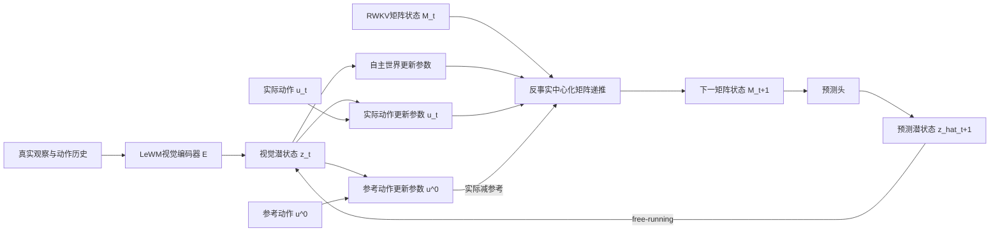

# 反事实递推 RWKV 世界模型：完整方法提案

> 工作名：**CC-RWKV-WM（Counterfactual-Centered RWKV World Model）**  
> 基础模型：LeWorldModel（LeWM）视觉编码器与联合嵌入预测目标  
> 第一阶段研究范围：只研究世界模型本身的长期 imagination；强化学习控制器延后  
> 状态：研究提案，不是已经验证的贡献。在完成直接近邻比较前，不应使用“首次”表述。

详细工程实施、数据接口、测试矩阵与阶段 Gate 见：
[CC-RWKV-WM 详细实施计划](cc_rwkv_implementation_plan.md)。

## 0. 最终建议

当前方法不再以“Transformer 换成 RWKV”为创新，也不把多步训练、强化学习控制或快慢时间尺度列为主要贡献。新的核心问题是：

> **能否让反事实动作直接参与 RWKV-7 矩阵记忆的衰减、擦除和写入，使模型在长期递推中持续保存正确的动作因果效应？**

普通动作条件 RWKV 将视觉状态和动作混合后，一次性生成全部更新参数：

$$
M_{t+1}=M_t\left[\operatorname{Diag}(w_t)+\alpha_t^\top\beta_t\right]+v_t^\top k_t.
$$

它没有指出矩阵更新中的哪部分表示环境自主变化，哪部分表示当前动作相对于“不干预”造成的变化。CC-RWKV-WM 在**每一个训练和推理递推步**同时计算：

- 实际动作 $u_t$ 对应的更新参数；
- 参考动作 $u^0$（通常为有效零动作）对应的反事实更新参数；
- 二者之差，作为动作对记忆衰减、擦除和写入的干预量。

核心递推为：

$$
\boxed{
M_{t+1}=\Phi_{\mathrm{world}}(M_t,z_t)
+\left[\Phi_{\mathrm{action}}(M_t,z_t,u_t)-\Phi_{\mathrm{action}}(M_t,z_t,u^0)\right]
}
$$

因此，反事实不是输出端的辅助分类或对比目标，而是实际决定下一时刻 RWKV 矩阵状态的递推运算。当 $u_t=u^0$ 时，动作干预项严格为零。



核心科学主张必须通过以下比较验证：

$$
\text{CC-RWKV-WM}>\text{DWM loss + vanilla RWKV}.
$$

如果只优于 Transformer-LeWM 或 vanilla RWKV，却不能优于在 RWKV 输出端加入 DWM 监督的基线，那么“反事实进入矩阵递推”没有被证明具有独立价值。

### 0.1 候选贡献的严格分工

1. **唯一的核心方法贡献**：counterfactual-centered generalized delta rule。实际动作与参考动作的参数差直接改变 RWKV 矩阵的 decay、erase 和 write，并在推理递推中持续使用。
2. **与核心机制绑定的监督**：真实配对干预轨迹上的 multi-step effect preservation。它不是独立创新，而是使递推机制具有物理可辨识性的训练信号。
3. **验证协议**：固定 50/100 primitive actions、期间无真实观察的 paired rollout evaluation。它用于避免 CEM/RL 或高频重规划遮蔽世界模型误差。

RL、多步普通预测loss和RWKV骨干均不列为贡献。

---

## 1. 研究范围与非贡献项

### 1.1 第一阶段只回答世界模型问题

第一阶段研究：

- 长真实历史是否被 RWKV 矩阵状态有效压缩；
- 动作因果效应是否在 5/10/20/50/100 步递推中被保留；
- 反事实中心化矩阵更新是否降低长期 rollout 误差；
- 收益是否超过 DWM 输出级分解、参数量增加和普通多步训练。

第一阶段暂不研究 RL Actor/Critic、在线探索、层次策略、子目标生成和真实机器人部署。只有世界模型机制通过预注册验收门槛后，第二阶段才冻结世界模型并训练相同的目标条件 RL policy。

### 1.2 以下内容不作为创新

- Transformer Predictor 替换成 RWKV Predictor；
- 使用 free-running、latent overshooting 或多跨度损失；
- 在 imagination 中训练强化学习策略；
- 使用快慢时间尺度 SSM；
- 使用不确定性惩罚。

这些可以是必要实现或强基线，但不能列为论文主要贡献。

---

## 2. 与直接近邻的差异边界

### 2.1 DWM

[DWM](https://arxiv.org/abs/2607.18715) 固定观察历史并扰动当前动作，通过训练期 world head 和正交目标将预测分成 action-invariant world effect 与 action-driven residual。它已在 LeWM、PushT-W、Reacher-W、TwoRoom-W 和 Ball-in-Cup 上证明该监督能降低 Rollout@20 误差并提高 CEM 成功率。

但 DWM：

- 不修改 LeWM Predictor 的内部递推；
- world head 只在训练期使用，推理时丢弃；
- 反事实扰动作用于输出表示，而不是记忆更新算子；
- 没有真实配对的替代动作未来监督；
- 没有固定 50/100 步无观测测试。

必要差异是：

$$
\text{DWM: counterfactual supervision on readout},
$$

$$
\text{CC-RWKV: counterfactual difference inside recurrent transition}.
$$

### 2.2 Mamba-CDSP

[Mamba-CDSP](https://proceedings.iclr.cc/paper_files/paper/2025/file/26f16a11f4dbba3eef876b571d9f3200-Paper-Conference.pdf) 通过去相关当前 treatment 与历史协变量表示，正则化 Mamba 的选择参数，用于时间变化的反事实结果估计。它不是动作条件视觉世界模型，也不学习完整未来状态、长程物理 rollout 或控制。其极长实验主要是长度 1000 的历史输入，未来预测通常为 5--10 步。

CC-RWKV-WM 不做 treatment-confounding correction，而是从同一物理状态执行不同动作分支，监督矩阵递推保存真实多步动作效应。

### 2.3 C-MCSS-Mamba

[C-MCSS-Mamba](https://www.mdpi.com/2076-3417/16/17/8413) 已将机制专属状态和反事实状态禁用放进 Mamba selective scan，用于语音深伪检测。这意味着不能声称“首次把反事实放入 SSM 内部状态更新”。

CC-RWKV-WM 的可检验差异只能是：

- RWKV-7 的矩阵值 generalized delta-rule，而不是 Mamba 向量 selective scan；
- 实际动作与参考动作之差直接构成矩阵衰减、擦除和写入；
- 反事实分支具有真实物理后继状态监督；
- 目标是长期 action-conditioned world rollout，而不是判别解释。

### 2.4 快慢时间尺度不是主要差异

MTS3、S4WM、MS-SSM 和 SF-RSSM 已覆盖多时间尺度 SSM 或世界模型。首版不加入快慢分支，避免把核心问题稀释成模块堆叠。

---

## 3. 问题定义与反事实数据

### 3.1 基础轨迹

普通轨迹数据为：

$$
\tau=(o_0,u_0,o_1,u_1,\ldots,o_T),\qquad z_t=E(o_t)\in\mathbb R^{d_z}.
$$

世界模型预测：

$$
\hat z_{t+h}=F_\theta(z_{\le t},u_{\le t+h-1}),\qquad h=1,\ldots,H.
$$

### 3.2 真实配对反事实分支

从相同 simulator state $s_t$ 和相同历史 $H_t$ 保存快照，执行至少两条动作序列：

$$
U^{(0)}=u^0_{t:t+H-1},\qquad U^{(1)}=u^1_{t:t+H-1}.
$$

得到：

$$
\tau^{(i)}_{t:t+H}=(o_t,u_t^{(i)},o_{t+1}^{(i)},\ldots,o_{t+H}^{(i)}).
$$

两条轨迹必须共享完全相同的初始 simulator state。确定性环境直接分支；随机环境主实验使用 common random numbers 固定外生噪声，只改变动作，另做独立噪声鲁棒性实验。

真实多步动作效应为：

$$
\Delta z^{\mathrm{CF}}_{t+h}=E(o_{t+h}^{(1)})-E(o_{t+h}^{(0)}).
$$

它不是根据模型输出构造的伪标签，而是来自同一初始状态下的真实环境干预。

### 3.3 参考动作

首选参考动作 $u^0$ 是环境中语义明确、合法的 do-nothing action。若零向量不是合法中性动作，必须预注册保持动作、行为策略条件均值或离散 no-op token。没有合理参考动作的任务不进入首版主实验。

### 3.4 分支采样与支持

每个快照使用 2--4 个分支：no-op、数据中真实动作、action-support 内局部扰动，以及可选的高差异动作。替代动作必须通过行为数据支持过滤，避免把 OOD 动作误差当作因果建模失败。

---

## 4. 基线：动作条件 vanilla RWKV 世界模型

### 4.1 输入和原始递推

$$
x_t=\operatorname{RMSNorm}(W_z z_t+W_u e(u_t)).
$$

对每层、每个 head，使用矩阵状态 $M_t\in\mathbb R^{d_h\times d_h}$。忽略 token shift、bonus term 和 channel mix，原始递推为：

$$
M_{t+1}=M_t[\operatorname{Diag}(w_t)+\alpha_t^\top\beta_t]+v_t^\top k_t.
$$

所有参数都由已经混合动作的 $x_t$ 产生。因此模型可以任意使用动作改变旧历史衰减、擦除方向和新写入关系，这正是反事实机制要直接约束的位置。

### 4.2 真实历史与想象使用同一状态

本方法不冻结独立历史状态。真实历史先写入 $M_t$；停止观察后，预测 latent 和动作继续更新同一个矩阵状态。研究对象是递推规则本身，而不是附加的历史缓存。

---

## 5. 核心方法：Counterfactual-Centered Delta Rule

### 5.1 禁止动作绕过矩阵递推

CC-RWKV 不再把视觉和动作相加后同时送入 RWKV readout。首先建立不含当前动作的状态输入：

$$
q_t=\operatorname{RMSNorm}(W_z z_t).
$$

动作嵌入 $e(u_t)$ 只能进入下文的 action-intervention parameter network。自主世界参数、receptance、channel mix 和最终预测头均不能直接读取当前 raw action：

$$
\hat z_{t+1}=P_{out}(\operatorname{RWKVRead}(M_{t+1},q_t)).
$$

因此，当前动作要影响 $\hat z_{t+1}$，必须先通过 factual-minus-reference 项改变 $M_{t+1}$。这是结构不变量，也是区别于“输出级DWM + 动作旁路”的必要条件。

### 5.2 参数分路

当前视觉/历史表示产生自主世界参数：

$$
(\ell_t^w,\alpha_t^w,\beta_t^w,v_t^w,k_t^w,\beta_t^a,k_t^a)=f_w(z_t,M_t).
$$

共享动作网络分别处理实际动作和参考动作：

$$
(\eta_t^a(u_t),\alpha_t^a(u_t),v_t^a(u_t))=f_a(z_t,M_t,u_t),
$$

$$
(\eta_t^a(u^0),\alpha_t^a(u^0),v_t^a(u^0))=f_a(z_t,M_t,u^0).
$$

实际动作相对参考动作的干预参数为：

$$
\delta\eta_t^a=\eta_t^a(u_t)-\eta_t^a(u^0),
$$

$$
\delta\alpha_t^a=\alpha_t^a(u_t)-\alpha_t^a(u^0),\qquad
\delta v_t^a=v_t^a(u_t)-v_t^a(u^0).
$$

### 5.3 反事实中心化衰减

$$
r_t^w=c\,\sigma(\ell_t^w),\qquad c=0.606531,
$$

$$
\eta_t^w=\log r_t^w,
$$

$$
w_t^{\mathrm{CF}}=\exp\{-\exp[\eta_t^w+\rho_t\odot\delta\eta_t^a]\},
$$

$$
\rho_t=\sigma(f_\rho(z_t,M_t,u_t)).
$$

$\rho_t$ 是动作修改历史保留速度的软门控。这里的动作差值作用于官方 RWKV7
decay rate 的 log-hazard，而不是直接重解释官方 decay logit。数值实现采用等价形式

$$
w_t^{\mathrm{CF}}=\exp\{-r_t^w\exp[\rho_t\odot\delta\eta_t^a]\},
$$

并只对动作 log-hazard residual 做有界截断。当动作差为零时，它严格还原官方
$\exp[-0.606531\,\sigma(\ell_t^w)]$；非零动作仍可把 retention 扩展到接近 0 或 1。

### 5.4 反事实中心化擦除、写入和最终更新

$$
G_t^{\mathrm{CF}}=\operatorname{Diag}(w_t^{\mathrm{CF}})
+(\alpha_t^w)^\top\beta_t^w+(\delta\alpha_t^a)^\top\beta_t^a,
$$

$$
U_t^{\mathrm{CF}}=(v_t^w)^\top k_t^w+(\delta v_t^a)^\top k_t^a,
$$

$$
\boxed{M_{t+1}=M_tG_t^{\mathrm{CF}}+U_t^{\mathrm{CF}}.}
$$

当 $u_t=u^0$ 时：

$$
\delta\eta_t^a=\delta\alpha_t^a=\delta v_t^a=0,
$$

递推严格退化为自主世界更新。这一性质由结构保证，而不是希望网络通过loss自行学会。

### 5.5 为什么共享 $\beta_t^a$ 和 $k_t^a$

状态/历史决定动作应修改或写入哪个记忆方向，实际与参考动作的差决定写入内容：

- $\beta_t^a$：动作应修改哪部分已有记忆；
- $k_t^a$：动作结果写入哪个关联位置；
- $\delta\alpha_t^a,\delta v_t^a$：相对参考动作的具体修改内容。

因此动作擦除和写入仍是 rank-1，整体是 diagonal + rank-2，而不是为每个动作复制完整矩阵状态。

### 5.6 反事实在推理时仍存在

推理时每一步都计算 $f_a(u_t)$ 与 $f_a(u^0)$，实际递推始终使用二者之差。增加的是一个轻量 action-parameter forward，而不是第二条完整未来 rollout。这与训练期辅助head不同。

---

## 6. 状态读取与分支递推

矩阵状态通过不读取当前动作的 RWKV receptance 和残差块产生隐藏表示，再预测下一 latent：

$$
h_t=\operatorname{RWKVRead}(M_{t+1},q_t),\qquad \hat z_{t+1}=P_{out}(h_t).
$$

同一真实历史得到共享初始状态后复制：

$$
M_t^{(0)}=M_t^{(1)}=\operatorname{clone}(M_t).
$$

两条动作分支各自 free-run：

$$
(M_{t+h}^{(i)},\hat z_{t+h}^{(i)})
=F_{CC-RWKV}(M_{t+h-1}^{(i)},\hat z_{t+h-1}^{(i)},u_{t+h-1}^{(i)}).
$$

一个分支的预测状态不得写回另一个分支。

---

## 7. 训练目标

### 7.1 普通多步状态预测

$$
\mathcal L_{pred}=\sum_{i\in\{0,1\}}\sum_{h=1}^{H}\omega_h
d(\hat z_{t+h}^{(i)},\operatorname{sg}(z_{t+h}^{(i)})).
$$

### 7.2 核心：多步反事实效应保持

$$
\Delta\hat z_{t+h}^{CF}=\hat z_{t+h}^{(1)}-\hat z_{t+h}^{(0)},
$$

$$
\boxed{
\mathcal L_{effect}=\sum_{h\in\mathcal H}\lambda_h
d(\Delta\hat z_{t+h}^{CF},\operatorname{sg}(\Delta z_{t+h}^{CF}))
}
$$

其中 $\mathcal H=\{1,5,10,20,50\}$，算力允许时加入100。普通多步loss约束“未来状态是否正确”；$\mathcal L_{effect}$ 约束“不同动作造成的未来差异是否正确”。

### 7.3 效应方向和幅度

$$
\mathcal L_{dir}=1-\cos(\Delta\hat z^{CF},\Delta z^{CF}),
$$

$$
\mathcal L_{mag}=|\log(\|\Delta\hat z^{CF}\|+\epsilon)-\log(\|\Delta z^{CF}\|+\epsilon)|.
$$

### 7.4 自主世界分支监督

对真实 no-op 分支，单独读取自主更新并监督：

$$
\mathcal L_{world}=d(R(\Phi_{world}(M_t,z_t)),\operatorname{sg}(z_{t+1}^{u^0})).
$$

该项防止自主分支退化、动作分支吸收全部动力学。

### 7.5 门控正则与总目标

$$
\mathcal L_{gate}=\|\rho_t\|_1+\lambda_{tv}\|\rho_t-\rho_{t-1}\|_1.
$$

$$
\mathcal L=\mathcal L_{pred}
+\lambda_{effect}\mathcal L_{effect}
+\lambda_{dir}\mathcal L_{dir}
+\lambda_{mag}\mathcal L_{mag}
+\lambda_{world}\mathcal L_{world}
+\lambda_{gate}\mathcal L_{gate}
+\lambda_{sig}\mathcal L_{SIGReg}.
$$

首版不加入 reward、value、policy 或 uncertainty loss。

---

## 8. 训练方式：不必从头训练整个模型

| 组件 | 初始化 | 第一阶段是否训练 |
|---|---|---:|
| LeWM ViT encoder/projector | 原始 LeWM checkpoint | 冻结 |
| action encoder | 原始 checkpoint 或兼容初始化 | 可训练 |
| vanilla RWKV predictor | 新建 | 必须训练 |
| CC action/reference heads | 零初始化新增 | 必须训练 |
| output prediction head | 复用初始化或新建 | 必须训练 |
| RL Actor/Critic | 暂不存在 | 否 |

Transformer Predictor 权重不能直接转换成 RWKV 矩阵状态，所以 predictor 必须训练；视觉编码器不必从随机初始化训练。

### Stage A：vanilla RWKV-LeWM

- 冻结视觉编码器；
- 普通轨迹训练 vanilla RWKV predictor；
- 评估 1/5/10/20/50 步；
- 不加反事实模块。

### Stage B：反事实单步初始化

- 加载兼容的 world/readout 参数；
- 新增 action/reference residual heads并零初始化；
- 使用成对一步 no-op/factual 分支；
- 训练 $\mathcal L_{world}+\mathcal L_{effect@1}$。

### Stage C：多步反事实课程

$$
1\rightarrow5\rightarrow10\rightarrow20\rightarrow50.
$$

每阶段使用完整 free-running；前一阶段稳定后再扩展。

### Stage D：可选联合微调

机制通过后可解冻 RWKV，并可选解冻视觉编码器最后2--4层；encoder学习率不超过predictor的0.1。必须保留 frozen-encoder 主结果，防止收益来自表示重学。

---

## 9. 代码实现映射

现有 Predictor 位于：

- `artifacts/assets/source/leworldmodel/module.py` 的 `ARPredictor`；
- `artifacts/assets/source/leworldmodel/jepa.py` 的 `predict` 与 `rollout`。

建议新增而非覆盖：

- `VanillaRWKVPredictor`；
- `CounterfactualCenteredRWKVPredictor`；
- `RWKVMatrixState`；
- `CounterfactualBranchBatch`。

当前 rollout 和本地 adapter 都显式截断到 `history_size`，默认仅最近3步。新实现必须改成：

```text
真实历史逐步写入 persistent RWKV state
→ imagination 开始时 clone state
→ 每个未来动作更新各自 branch state
```

建议接口：

```python
state = predictor.init_state(batch_size)
state, pred = predictor.step(z_t, action_t, state, reference_action)
branch_state = predictor.clone_state(state, num_branches)
rollout = predictor.rollout(z_t, action_sequences, branch_state)
```

训练时额外返回 world/action decay、erase、write 和 intervention gate，供机制诊断。

### Kernel 风险

CC-RWKV 是 diagonal-plus-rank-two 更新，原生 RWKV-7 kernel 可能假设 rank-one。先用 PyTorch/einsum 参考实现验证，再开发 Triton/CUDA kernel。不能为了沿用原 kernel 而把方法退化成输出端辅助loss。

---

## 10. 数据与任务

### 10.1 可辨识诊断

| 任务 | 环境自主效应 | 动作效应 | 诊断 |
|---|---|---|---|
| TwoRoom-W | constant drift | 2D movement | 世界漂移与动作叠加 |
| Hidden-Velocity TwoRoom | 隐速度惯性 | 加速度动作 | 历史是否保留速度 |
| Action-Delay | 延迟执行 | 动作在 $d$ 步后生效 | 动作效应是否长期保留 |
| Door/Switch | 门状态保持 | 开关动作不可逆 | 动作是否正确改变记忆 |
| Stochastic Drift | 外生扰动 | 受控移动 | common-noise 与独立噪声 |

### 10.2 DWM同任务强比较

- PushT / PushT-W；
- DMC Reacher / Reacher-W；
- TwoRoom / TwoRoom-W；
- Ball-in-Cup。

### 10.3 长程视觉动力学

- OGBench visual PointMaze / AntMaze；
- OGBench visual Cube；
- OGBench Scene 或 Puzzle；
- unseen dynamics、action delay、observation masking 变体。

只选择支持 simulator snapshot/restore 或严格配对干预数据的环境进入主结果。

### 10.4 Horizon口径

必须同时报告 primitive environment steps、model transitions、action block size 和 observation stride。不能用“20个模型步对应100帧”直接声称“100步动作 imagination”。主表统一使用 primitive action 数量。

---

## 11. 实验与指标

### 11.1 递推机制诊断

对相同 $M_t,z_t$ 输入多个动作，测量 $\|\delta\ell_t^a\|$、$\|\delta\alpha_t^a\|$、$\|\delta v_t^a\|$ 和 $\rho_t$。检查 no-op 是否数值归零、不同动作是否产生不同更新、world参数是否严格不读取动作，以及gate是否只在真实动作影响处开启。

额外做 action-bypass audit：在保持 $M_{t+1}$ 固定时替换当前动作，预测输出必须保持不变；只有重新计算 counterfactual-centered update 后，输出才能随动作变化。

### 11.2 反事实效应指标

$$
\operatorname{CEE}(H)=\mathbb E\|\Delta\hat z_{t+H}^{CF}-\Delta z_{t+H}^{CF}\|_2,
$$

$$
\operatorname{CED}(H)=1-\cos(\Delta\hat z_{t+H}^{CF},\Delta z_{t+H}^{CF}),
$$

$$
\operatorname{CER}(H)=\frac{\|\Delta\hat z_{t+H}^{CF}\|}{\|\Delta z_{t+H}^{CF}\|+\epsilon}.
$$

$\operatorname{CER}\to0$ 表示长期忽略动作，显著大于1表示放大动作影响。

### 11.3 总体 imagination

在 $H\in\{1,5,10,20,50,100\}$ 报告 latent error、evaluator-only physical state error、endpoint error、trajectory error AUC、error growth slope及事件状态准确率。

### 11.4 长历史利用

构造 same-image/different-history 数据：相同位置不同速度、相同门外观不同开关历史、相同画面不同延迟状态、相同局部观察不同漂移参数。比较未来预测和矩阵状态 probe。

### 11.5 固定动作、无控制器混淆

第一阶段使用 held-out 固定动作序列：只在 $t$ 观察真实状态，模型 free-run 50/100 步，环境执行相同动作，中途不给模型真实观察。比较完整预测与真实轨迹。这样不会被 MPC 重规划或 RL policy 差异混淆。

机制通过后可以用相同CEM做sanity check，但不能替代固定动作 fidelity 主结果。

---

## 12. 必须实现的基线与消融

| 编号 | 模型 | 目的 |
|---|---|---|
| B0 | Transformer-LeWM | 原始架构 |
| B1 | DWM-Transformer | 已有输出级分解 |
| B2 | vanilla RWKV-LeWM | 单纯替换 Predictor |
| B3 | DWM-RWKV | DWM loss 加到 RWKV 输出端 |
| B4 | rank-two RWKV，无反事实中心化 | 排除参数容量收益 |
| B5 | CC-RWKV，仅动作置换弱监督 | 无真实分支数据版本 |
| B6 | CC-RWKV，真实一步配对 | 递推结构测试 |
| B7 | CC-RWKV，真实多步配对 | 完整方法 |

所有RWKV基线匹配hidden width、层数、训练步数、encoder和普通多步loss，并提供参数量匹配版本。

核心消融：移除decay/erase/write各反事实残差、移除reference subtraction、改变reference action、移除 $\mathcal L_{effect}$、effect@1 vs effect@1:50、动作置换 vs 真实配对、frozen vs end-to-end、rank-one vs matched rank-two、history=3/10/50/full。

还必须加入“允许 raw action 直接进入 readout”的消融。如果该旁路版本与完整方法相同，说明矩阵递推不是动作效应的必要载体，核心机制主张不成立。

---

## 13. 预注册验收门槛

### Gate A：递推机制成立

- no-op 干预项小于预设数值 tolerance；
- 固定 $M_{t+1}$ 时替换 raw action 不得改变预测，证明不存在动作读取旁路；
- 能从动作更新差异恢复动作，显著优于随机；
- world-only分支no-op预测不劣于vanilla RWKV；
- intervention gate不全部为0或1。

### Gate B：超过输出级DWM

相对最强 B3/B4：CEE AUC 至少下降15%，Rollout@20和@50均改善，one-step恶化不超过3%；至少3个随机种子，paired bootstrap 95% CI不跨0。

### Gate C：长期效果成立

至少一个导航和一个接触任务上，Rollout@50 trajectory-error AUC下降至少10%，CER(50)更接近1，Rollout@100不出现更快误差爆炸，且结果按相同primitive-action horizon成立。

### Gate D：历史记忆成立

same-image/different-history中full-history优于history=3；矩阵probe能恢复隐藏速度/延迟/门状态；预测差异与真实未来方向一致。

未通过相应Gate时必须删除对应主张，不能增加RL或更多模块掩盖失败。

---

## 14. 失败判据与论文表述

以下结果否定或缩小方法：DWM-RWKV与CC-RWKV相同；rank-two容量解释全部收益；只改善一步；动作效应长期趋零；gate饱和；reference无稳定语义；真实配对收益仅来自更多样本；history=3与full相同；必须频繁重规划才有效。

“更多样本”必须用数据量匹配基线排除：普通RWKV使用相同数量分支轨迹，但不使用配对关系和effect loss。

Gate A--C通过后可写：

> We introduce a counterfactual-centered generalized delta rule for matrix-state world models, where factual-minus-reference action updates directly modulate recurrent decay, erasure, and writing. Paired interventional rollouts supervise preservation of action effects over long free-running horizons.

Gate D也通过后可增加：

> The resulting matrix state retains history-dependent latent dynamics and improves observation-free rollout fidelity at 50--100 primitive-action horizons.

不能声称首次将反事实引入SSM、首次用RWKV构建世界模型、解决全部长期imagination、多步训练本身创新或RL控制创新。

---

## 15. 后续强化学习接口

只有 Gate A--D 通过后才进入第二阶段：冻结各世界模型，对每个模型训练完全相同的 goal-conditioned Actor/Critic；Actor在模型内部按预测状态逐步产生动作；测试 Fixed-5/25/50/100 无真实观察执行。RL只检验长期imagination是否转化为控制收益，不作为第一阶段创新。

---

## 16. 推荐执行顺序

1. 实现 stateful vanilla RWKV predictor，移除 history=3 重置；
2. 在 TwoRoom-W/Action-Delay 建立 simulator snapshot 双分支数据；
3. 实现 CC-RWKV PyTorch rank-two 参考递推和 no-op 单元测试；
4. 训练 B2、B3、B4、B6，完成一步及 Rollout@20 对比；
5. Gate A--B 通过后采集50步真实配对分支；
6. 训练完整B7，报告CEE/CED/CER和rollout曲线；
7. 在PushT-W、Reacher-W、Ball-in-Cup复验；
8. Gate C--D通过后迁移OGBench并优化kernel；
9. 最后再考虑RL控制规划。

最小可证伪实验是：

> 在完全相同的初始状态下，实际动作与no-op产生不同真实未来；CC-RWKV的矩阵更新差是否比DWM-RWKV更准确地保持这一差异到第20和第50步？

如果答案是否定的，就不应继续增加RL、层次结构或更多控制模块。
