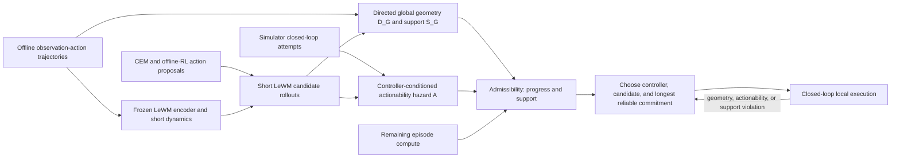

# LeWM 长程任务创新方法提案

> 基于 [世界模型长程机制综述](../Long-horizon_world_model_mechanisms_review.md)  
> 约束：LeWM 为主要 frozen backbone；simulation/offline 为主；不做生成任务；不以真实机器人部署为目标。  
> 状态：研究提案，不是已验证贡献。方法名均为工作名，完成关键消融前不应写“首次”。

## 0. 最终建议

首选方案是：

**GATE-WM：Geometry–Actionability Decomposition with Temporal Execution**

核心不是再增加一个 hierarchy、duration head 或 conformal quantile，而是把长程规划中经常混为一谈的两个问题拆开：

1. **全局几何（geometry）**：在离线数据所支持的环境结构中，从当前状态到目标是否存在可拼接路径、还需多少进展；
2. **控制器可行动性（actionability）**：给定当前低层控制器、规划预算和执行时长，它能否可靠完成这个局部转移。

全局几何从大规模被动 observation-action 轨迹学习，尽量与具体 controller 解耦；actionability 从少量、严格分割的 simulator closed-loop attempts 学习，并显式条件于 controller/budget。规划器用短 LeWM rollout 评价候选终点的全局进展，再用 actionability survival model 决定哪个 controller 和最长可靠 commitment。

这一设计的关键可证伪主张是：

> 将可复用的全局环境几何与 controller-specific actionability 分开，能否比单一 reachability/risk head 更准确地识别“路径存在但当前控制器执行不了”的候选，并在更换控制器或计算预算时仅用少量执行样本完成适配？

如果这个主张不成立，就不应继续叠加 conformal、event trigger 或更复杂 hierarchy。

---

## 1. 从综述导出的设计要求

### 1.1 必须解决

| 要求 | 对应瓶颈 | 方法必须提供的证据 |
|---|---|---|
| planner cost 表示方向性、拓扑和长期进展 | B3、B5 | same-candidate ranking 和 structural-distance audit |
| 正确候选能进入搜索集 | B4 | oracle-best candidate coverage |
| 长 commitment 不是名义存在而实际塌缩 | B6、B11 | plan-level duration 分布和 fixed-duration 对照 |
| 区分路径存在与低层执行失败 | B7 | matched structural/execution counterfactual pairs |
| 不把未覆盖 pair 当作不可达 | B15 | support-stratified error 和 abstention |
| 不通过更多反馈或更多计算获得假收益 | B14、B16 | equal-feedback、equal-compute 主表 |

### 1.2 暂不解决

首版 GATE-WM 不主张解决：

- 严重部分可观测下的 belief-state learning；
- 任意多模态 stochastic future；
- reward learning；
- 跨真实机器人的安全保证；
- 完全 distribution-free 的部署保证；
- backbone representation collapse。

这些问题需要改动 LeWM 状态定义或数据假设，会使论文失去清楚的因果中心。首版任务应以近似 Markov 的像素观测为主；POMDP 只作为明确标注的扩展。

---

## 2. 候选方法比较与淘汰

| 候选 | 核心想法 | 创新潜力 | 实现可行性 | 主要近邻 | 决策 |
|---|---|---:|---:|---|---|
| **GATE-WM** | 分离 global geometry 与 controller/budget-conditioned actionability，联合选 controller 和可靠 commitment | 3/5，待 transfer 证据提高 | 4/5 | SSE、adjacency HRL、QRL、MAC | **首选** |
| SUPPORT-WM | 把 pair 分成 reachable / unreachable / unknown，未知时 abstain 或用 simulator 查询 | 2–3/5 | 4/5 | CGCIVL、SSE、MOPO | 合并为 GATE 的 support gate |
| FOCAL-WM | 对 planner 选中的极端候选做 selection-conditional conformal | 2/5 | 2–3/5 | JRSS-B 2025、PlanCP、Fb-CP | 只作统计扩展 |
| BUDGET-WM | 学习 observation/replanning 的 value of computation | 2/5 | 4/5 | M3PC、MACURA、Sparse Imagination | 作为后续 compute 模块 |
| BELIEF-BRANCH-WM | LeWM latent 上维护多分支 belief 并主动消歧 | 4/5 | 1–2/5 | RSSM、UWM-JEPA、R2I | 与 frozen LeWM 首版冲突，暂缓 |
| CAPE 原方案 | multi-scale macro model + conformal tube + event trigger | 1–2/5 | 3/5 | THICK、MACURA、PlanCP、options | 不作为主要创新 |

### 2.1 为什么 selection-aware conformal 不能独立作为核心

[Confidence on the Focal](https://academic.oup.com/jrsssb/article/87/4/1239/8113856) 已在 JRSS-B 2025 正式发表，给出 selection-conditional coverage 的一般框架，并明确覆盖 top-k 与 optimization-based selection。PlanCP 和 feedback conformal trajectory optimization 又覆盖了 planning/control 应用。

因此，项目可以研究：

- 如何把 selection-conditional 方法实例化到 world-model candidate pools；
- adaptive replanning 下如何定义 selection taxonomy；
- coverage 与 planner compute 的关系。

但不能把“发现 planner selection 会破坏普通 split conformal”本身作为主要原创点。

### 2.2 为什么 unreachable-subgoal 修正也不能独立作为核心

[Strict Subgoal Execution](https://proceedings.iclr.cc/paper_files/paper/2026/hash/ec94195bca07a55e83968fbfa6efb8b0-Abstract-Conference.html) 已用失败和 partial-success transitions 划分 reachability frontier，并按低层失败修正图边；[CGCIVL](https://proceedings.mlr.press/v267/ke25a.html) 已针对 unconnected state-goal pairs 的 value overestimation 加入 conservative penalty。

GATE-WM 必须额外证明：

- geometry 可以跨低层 controller 和 planning budget 复用；
- actionability residual 能以显著少于重学全局 value 的样本适配；
- 分解后的两个输出分别对应结构错误和控制器错误，而不是两个冗余网络。

---

## 3. GATE-WM 问题定义

### 3.1 数据

使用三个严格隔离的数据源：

1. **离线结构集 $\mathcal D_{\mathrm{off}}$**  
   由 observation-action trajectories 组成，用于 LeWM 和 global geometry。允许 future observation relabeling，不需要 reward。

2. **执行适配集 $\mathcal D_{\mathrm{exec}}$**  
   在 simulation 中由冻结的低层 controller 执行局部 goal attempts 得到。记录 controller、budget、duration、是否命中、首达时间、终点、失败类型和模型调用量。

3. **selection / calibration / final-test**  
   按 trajectory 和 environment layout 隔离。任何 threshold、controller 组合和 duration 准入都不能查看 final-test。

若使用 $\mathcal D_{\mathrm{exec}}$，方法应写成：

> offline LeWM and geometry learning with simulator-based controller adaptation

不能写成 fully offline。

### 3.2 命中标签与 privileged supervision

actionability 的事件 $T_s$ 必须有不循环依赖于待学习 head 的定义。

首选 simulation 协议使用 evaluator-only task state 或环境 success predicate 标记“首次命中 subgoal tolerance”的时间。真实状态只生成 binary/time-to-hit label，不进入 LeWM、geometry、actionability 输入或 planner。此设置应明确写成：

> image-conditioned planning with privileged simulator labels for controller adaptation

它不是纯 observation-action supervision。另做一个 image-only ablation，可以用冻结的 goal-success classifier 或严格的未来观测匹配产生标签，但不能用正在训练的 $D_G$ 自己定义成功，否则会形成自证循环。

### 3.3 Frozen backbone

$$
z_t=E(o_t),\qquad
\hat z_{t+k}=F(z_t,a_{t:t+k-1}),
$$

其中 $E,F$ 为冻结 LeWM。GATE-WM 不通过重新训练 backbone 获得收益，避免与 RC-aux、VLWM、SCALE 混淆。

### 3.4 Controller descriptor

每个局部执行器由 descriptor $c$ 表示：

$$
c=(\text{controller type},\ \text{search budget},\ \text{feedback mode},\ \text{action chunk size}).
$$

首版至少包含：

- CEM-small；
- CEM-large；
- behavior-supported action-chunk / offline RL policy。

controller type 可以用 embedding；数值预算必须作为连续特征，使模型能测试未见中间预算的插值，而不是记住三个 ID。

---

## 4. 模块一：与部署 controller 解耦的 global geometry

### 4.1 输出

学习 directed structural distance：

$$
D_G(z_i,z_j)\ge 0.
$$

它表示在离线数据支持的动力学结构中，从 $z_i$ 到 $z_j$ 的相对最短时间或代价。它不是：

- raw latent L2；
- 当前 controller 的成功概率；
- “数据中未出现即不可达”的二分类器。

“解耦”只相对于**部署时被选择的低层 controller**。$D_G$ 仍受离线数据收集策略和 coverage 影响，不应称为真实环境最优距离。跨数据收集策略泛化必须单独测试，不能由 controller-transfer 结果推出。

### 4.2 监督

**同轨迹正对。** 对 $i<j$，时间差 $\Delta t=j-i$ 提供有方向的 interval/hitting-time 监督。

**可拼接路径。** 在 latent kNN 图中，只对通过局部、数据支持边连接的节点使用 shortest-path 或 min-plus target。跨轨迹 pair 若没有证据连接，标为 unknown，而不是 negative。

**结构一致性。**

$$
D_G(z_i,z_k)
\le
D_G(z_i,z_j)+D_G(z_j,z_k).
$$

可采用 QRL、multistep quasimetric 或 Transitive RL 风格的结构化更新。首版建议从现有 DirectedReachabilityDistribution 迁移到 multistep quasimetric loss，而不是同时实现三种新算法。

### 4.3 损失

一个可执行的首版目标是：

$$
\mathcal L_G
=
\mathcal L_{\mathrm{interval}}
{}+\lambda_{\mathrm{tri}}\mathcal L_{\mathrm{triangle}}
{}+\lambda_{\mathrm{trans}}\mathcal L_{\mathrm{minplus}}
{}+\lambda_{\mathrm{rank}}\mathcal L_{\mathrm{listwise}}.
$$

- $\mathcal L_{\mathrm{interval}}$：同轨迹 temporal bins 的 ordinal/cross-entropy；
- $\mathcal L_{\mathrm{triangle}}$：惩罚 triangle violation；
- $\mathcal L_{\mathrm{minplus}}$：经可信中间点的 composed target；
- $\mathcal L_{\mathrm{listwise}}$：对真实 planner candidate pool 训练终点的结构排序，而非只对随机 pair；target 只能来自离线图/轨迹结构，不能使用当前 controller 的执行成败。

listwise loss 只使用 selection split 之前生成的训练 candidate pools，不能用 final-test candidates。

### 4.4 Support / unknown

额外输出证据分数 $S_G(z_i,z_j)$，由以下量组成：

- latent kNN density；
- ensemble disagreement；
- 是否有可信图路径；
- composed path 上最弱边的 support。

规划时低 support 表示 unknown，不解释为 unreachable。主实验需要单独报告：

$$
\text{error}\mid S_G\in
\{\text{high},\text{medium},\text{low}\}.
$$

---

## 5. 模块二：controller-conditioned actionability

### 5.1 为什么用 survival / first-passage model

简单 binary success head 会丢失以下信息：

- 目标第 6 步到达，duration=5 失败但 duration=10 成功；
- attempt 在 duration 截止时未到达，只能视为 right-censored；
- 同一个 subgoal 对 CEM-large 可行、对 CEM-small 不可行；
- planner 需要任意 duration 的累计成功概率，而不是四个互不一致的分类器。

因此学习离散 hazard：

$$
h_\phi(k\mid z,s,c,\xi)
=
P(T_s=k\mid T_s\ge k,z,s,c,\xi).
$$

$\xi$ 是 candidate trace descriptor，至少包含 action-chunk embedding、预测路径的曲率/动作变化、最小 support 和 LeWM disagreement。若局部 controller 会在执行前重新生成完整动作，则 $\xi$ 可省略；若直接执行被选 action sequence，则不能只用起点、终点和 controller ID 预测 candidate-specific failure。

累计 actionability 为：

$$
A_\phi(d\mid z,s,c,\xi)
=
P(T_s\le d\mid z,s,c,\xi)
=
1-\prod_{k=1}^{d}(1-h_\phi(k\mid z,s,c,\xi)).
$$

它天然随 $d$ 单调，不需要为 5/10/20/40 单独校准互相矛盾的 success logits。

### 5.2 Censored survival loss

对成功且首达时间为 $T$ 的 attempt：

$$
\mathcal L_{\mathrm{hit}}
=
-\log h_\phi(T)-\sum_{k<T}\log(1-h_\phi(k)).
$$

对执行到 $d$ 仍未到达的 right-censored attempt：

$$
\mathcal L_{\mathrm{censor}}
=
-\sum_{k\le d}\log(1-h_\phi(k)).
$$

再加两个辅助目标：

- 实际 structural progress regression；
- failure cause classification：model error、proposal error、collision/stall、support/OOD。

failure cause 只用于诊断和 event policy，不进入主 success score，避免多头 loss 抢占主任务。

### 5.3 Geometry–actionability gap

定义诊断量：

$$
\Gamma_c(z,s,d)
=
\operatorname{logit}R_G(d\mid z,s)
-
\operatorname{logit}A_\phi(d\mid z,s,c,\xi),
$$

其中 $R_G$ 是由 global geometry 得到的 data-supported structural reachability。

- $R_G$ 高、$A_\phi$ 高：路径存在且 controller 可执行；
- $R_G$ 高、$A_\phi$ 低：**GATE-WM 的目标失败类型**；
- $R_G$ 低、support 高：结构上远或不可达；
- support 低：unknown，必须 abstain。

$\Gamma_c$ 是分析接口，不强制非负。这样可避免错误假设“数据轨迹一定比当前 controller 最优”。

### 5.4 跨 controller 适配

预训练共享 trunk 后，只用少量新 controller attempts 更新：

- controller embedding；
- 最后一层 hazard adapter；
- 可选 calibration temperature。

核心 transfer 指标：

$$
\text{adaptation fraction}
=
\frac{\text{新 controller 所需 attempts}}
{\text{从头训练 actionability 所需 attempts}}.
$$

只有当 adaptation fraction 显著小于 1，并接近 full-data 性能时，“geometry 可复用”才有证据。

---

## 6. 模块三：联合选择 candidate、controller 和 commitment

### 6.1 Candidate portfolio

首版保留当前 CEM，第二阶段增加 offline RL/action-chunk proposal。每个 candidate 记录：

$$
x=(a_{0:d_{\max}-1},\hat z_{1:d_{\max}},c,\text{compute}).
$$

不同 controller 可以共享 candidate endpoint，也可以产生自己的候选。必须保存 same-candidate audit，区分 proposal 与 ranking。

### 6.2 Structural progress

对 prefix $d$：

$$
\Delta_G(d)
=
D_G(z_t,g)-D_G(\hat z_{t+d},g).
$$

用 ensemble 或 held-out residual 得到 progress lower bound $\underline{\Delta}_G(d)$。这里的 bound 首版只称 empirical lower confidence bound；除非完成严格 calibration，不使用 conformal guarantee。

### 6.3 Feasibility-constrained longest commitment

对 candidate-controller pair，定义 admissible duration：

$$
\mathcal D_{\mathrm{adm}}
=
\left\{
d:
\underline{\Delta}_G(d)\ge\epsilon,\ 
A_\phi(d\mid z_t,\hat z_{t+d},c,\xi)\ge 1-\rho,\ 
S_G(z_t,\hat z_{t+d})\ge\tau,\ 
C(c,d)\le B_{\mathrm{remain}}
\right\}.
$$

选择：

$$
d^\*_{x,c}
=
\max \mathcal D_{\mathrm{adm}}.
$$

先为每个 candidate-controller pair 取得最长 admissible duration，再在所有 surviving triplets 中按“duration 优先、效用次优”的预注册 lexicographic rule 选择；如果不希望 duration 成为第一目标，则必须把另一种 rule 作为预注册主方案，不能看 final-test 后切换。在同一 duration 下按以下量选 candidate 和 controller：

$$
J
=
\underline{\Delta}_G(d^\*_{x,c})
-\lambda_{\mathrm{cmp}}C(c,d^\*_{x,c})
-\lambda_{\mathrm{ood}}U_G.
$$

其中 $B_{\mathrm{remain}}$ 是 episode 剩余 planning budget，不允许通过局部升级 controller 超支。“先过可靠性约束，再选最长 commitment”比把 progress/duration、risk、compute 全塞入一个 scalar 更容易解释，也直接针对当前 5-step collapse；lexicographic rule 必须与 scalar baseline 正面对照。

若没有 admissible duration：

1. 提高 controller budget；
2. 换 behavior-supported RL/action-chunk controller；
3. 缩短 duration；
4. 全部失败时执行最短 support-safe fallback，并记录 abstention。

### 6.4 为什么联合选 controller

固定 controller 会把“长尺度不可行”误解释为 world-model 长程失败。GATE-WM 允许：

- 简单局部段使用便宜 controller；
- 拓扑或接触困难段使用更高 search budget；
- 行为数据支持强时使用 amortized RL chunk；
- OOD 或高风险时退回保守 controller。

这样研究问题从“哪个固定 horizon 最好”变为：

> 在相同 episode-level compute budget 下，怎样把 controller capacity 分配给真正困难的局部转移？

这与 M3PC/MACURA 的区别必须通过 global-geometry/actionability 分解和 controller-transfer 实验体现，而不能只靠最终 success。

---

## 7. 闭环执行与停止

### 7.1 反馈定义

允许低层 controller 每步读取新 observation 进行局部纠偏，但在 commitment 内不重新运行昂贵的全局 candidate search。必须分别记录：

- low-level feedback updates；
- global replans；
- LeWM rollouts；
- controller forward/model calls。

这证明的是 temporal abstraction，不是假装长 open-loop。

### 7.2 事件

只保留与两个核心对象对应的事件：

1. **geometry violation**：实际 $D_G$ progress 显著低于计划 lower bound；
2. **actionability violation**：在线 survival probability 降至阈值以下；
3. **support violation**：当前 latent 进入 low-support 区；
4. **subgoal reached / duration exhausted**。

不再同时堆叠 latent tube、raw goal stall、endpoint miss 等高度相关规则。每个 event 都必须有单独 precision/recall。

### 7.3 局部到全局的条件性命题

若在真实闭环分布上，每个被执行 commitment：

- 以至少 $1-\rho$ 的概率使 $D_G$ 减少至少 $\epsilon$；
- failure 后不会使 $D_G$ 增加超过已知上限；
- $D_G$ 对最终 goal 为 0；

则到达目标所需的成功 high-level commitments 至多约为：

$$
N\le \left\lceil D_G(z_0,g)/\epsilon\right\rceil.
$$

这是解释 temporal composition 的条件性命题，不是现有模型已经满足的 theorem。实验必须直接测量每次 commitment 的 contraction violation rate。

---

## 8. Selection-aware calibration 的正确位置

### 8.1 首版

首版最稳妥做法：

- 用训练集拟合 geometry/actionability；
- 用 selection split 固定完整 planner、threshold 和 controller portfolio；
- 在独立 calibration episodes 上运行冻结 planner；
- 只对**实际被选中的** candidate-controller-duration 统计 reliability diagram、ECE、Brier 和 empirical coverage；
- 不给 finite-sample conditional guarantee。

### 8.2 高风险扩展

若要做严格 selection-conditional calibration，应以 JRSS-B 的 focal selection 框架为起点，而不是重新发明：

- 选择单元：一个 episode 中 planner 选中的 candidate；
- selection taxonomy：controller、duration、candidate-pool size、compute budget；
- outcome：实际 progress 或 local completion；
- sequential replanning：每个高层决策是否仍可视为 exchangeable unit，需要单独证明或采用 episode-level score。

此扩展可能有统计贡献，但不是 GATE-WM 首版成立的必要条件。

---

## 9. 与现有代码的映射

| 现有组件 | 可复用 | 需要修改 |
|---|---|---|
| WorldModelAdapter | encode、rollout、goal interface | 增加 batch candidate metadata 即可，backbone 不改 |
| DirectedReachabilityDistribution | 网络结构、hitting-time bins | 改成 global geometry；加入 support 和 structured loss |
| ReachabilityAdvantageCalibrator | duration 分层记录 | 不再作为主要选择器；只作 baseline |
| ExecutabilityRiskHead | current/subgoal/duration features | 改为 controller-conditioned hazard/survival 输出 |
| CandidateGenerator | duration proposals、fallback | 支持 controller portfolio 和 controller descriptor |
| CAPEPlanner | event loop、diagnostics | 替换 scalar score 为 admissibility + longest-feasible rule |
| audit / JSONL | candidate、planning cost、event | 增加 controller、support、hazard、geometry/actionability gap |

建议新增而不是原地混改：

- src/cape_wm/geometry.py；
- src/cape_wm/actionability.py；
- src/cape_wm/gate_planner.py；
- configs/gate_phase_a.yaml；
- docs/gate_method.md。

在 GATE-WM 通过机制 gate 前，不删除 CRAFT/CAPE，保留它们作为可复现 baseline。

---

## 10. 分阶段实现

### Phase 0：数据和诊断复用

- 冻结当前 LeWM checkpoint；
- 把现有 TwoRoom candidate/attempt 记录转换为统一 schema；
- 标记 controller、budget、duration、hit time、censoring、failure cause；
- 复现 CRAFT Level-0 数字。

完成标志：转换前后 episode/candidate 数量、成功率和 duration 统计完全一致。

### Phase 1：最小双分解

- $D_G$：沿用当前 directed reachability backbone，但禁止随机跨轨迹 negative；
- $A_\phi$：5/10 步、单 CEM controller 的 censored hazard；
- planner：admissible + longest feasible；
- 只在 TwoRoom 做同候选机制测试。

目标不是刷新 success，而是证明：

- geometry 与 actionability 对两类失败给出不同信号；
- hazard 比 binary risk 更好；
- duration 选择不再因 scalar score 机械塌缩。

### Phase 2：controller transfer

- 加入 CEM-small / CEM-large / action-chunk controller；
- 固定 $D_G$；
- 比较新 controller 的 1%、5%、10%、25%、100% execution adaptation；
- 联合选 controller、budget、duration。

这是首篇论文最关键的创新实验。

### Phase 3：OGBench 与真正长程

- visual Point/Ant Maze；
- visual Cube、Scene 或 Puzzle 至少两类；
- $H^\*\ge100$，并扩展到 200/500；
- stitching、stochastic teleport、unseen layout/dynamics；
- equal-feedback 与 equal-compute。

### Phase 4：可选扩展

- strict selection-conditional calibration；
- feedback risk allocation；
- 部分可观测 history encoder；
- learned value-of-replanning。

Phase 4 不得成为 Phase 1–3 失败后的遮掩模块。

---

## 11. 基线

### 11.1 必须实现

- LeWM + latent L2；
- LeWM + TRM；
- 当前 CRAFT；
- single merged reachability/executability head；
- GATE geometry-only；
- GATE actionability-only；
- GATE dual decomposition；
- fixed controller、fixed 5/10/20/40；
- same proposal pool 下的所有 selector。

### 11.2 强外部机制

- QRL / multistep quasimetric；
- HIQL 或 TD-JEPA；
- CGCIVL；
- SSE / RD-HRL；
- MAC action chunks；
- MACURA adaptive rollout；
- HWM/VLWM 仅作为 LeWM 近邻补充。

若计算资源有限，优先保证每类机制一个强正式 baseline，而不是堆多个弱复现。

---

## 12. 核心消融

| 消融 | 要回答的问题 |
|---|---|
| merged head vs dual heads | 分解是否真的有信息增益 |
| controller descriptor 移除 | actionability 是否确实 controller-specific |
| binary success vs censored hazard | first-passage 建模是否值得 |
| cross-trajectory unknown 当 negative | 错误负样本是否伤害 stitching |
| support gate 移除 | 收益是否来自 OOD 乐观利用 |
| longest feasible vs scalar weighted score | duration 不塌缩是否来自选择规则 |
| CEM-only vs RL/action-chunk proposal | 收益来自 proposal 还是 selector |
| global geometry frozen vs jointly finetuned | controller attempts 是否污染全局几何 |
| equal-feedback / equal-compute | 收益是否只是更多反馈或算力 |
| controller swap few-shot vs full retrain | 可复用几何主张是否成立 |

---

## 13. 预注册验收门槛

### Gate A：分解成立

在 held-out candidate attempts 上，相比 merged head：

- actionability AUPRC 至少提高 0.08；
- structural ranking 的 selected regret 至少降低 15%；
- geometry/actionability gap 对“结构可达但执行失败”类别 AUROC 至少 0.75；
- 两个 head 的误差相关不能接近 1，否则分解可能冗余。

未通过：停止 GATE 主线，回退到单一 quasimetric + RL proposal。

### Gate B：controller transfer 成立

新 controller 只用不超过 full-data 10% 的 attempts：

- actionability AUPRC 达到 full retrain 的 95%；
- local success 与 full retrain 相差不超过 3 pp；
- 明显优于不含 controller descriptor 的 pooled head。

未通过：删除“可迁移 geometry/actionability”主张，方法降为 controller-specific risk model。

### Gate C：时间抽象成立

相对 GATE Fixed-5：

- 平均实际 commitment 至少 15 步；
- global replans 至少减少 30%；
- success 非劣界为 -3 pp；
- 至少 3 个 duration 通过尺度准入并进入正式选择。

未通过：不能声称 temporal abstraction。

### Gate D：长任务成立

在 $H^\*\ge100$ 的多环境集合：

- 相对最强 equal-compute baseline 成功率至少 +10 pp；
- paired 95% CI 下界大于 0；
- success-horizon AUC 显著提高；
- 不通过增加 observation/feedback 次数获得。

未通过：结论停留在 local executability，不称长程方法。

### Gate E：泛化成立

在 unseen layouts/dynamics：

- 相对同分布性能的保持率达到预注册阈值；
- support score 能识别 degradation；
- abstention/fallback 比乐观执行减少不可恢复失败。

---

## 14. 任务矩阵

| 层级 | 任务 | 验证内容 |
|---|---|---|
| Level 0 | TwoRoom / MultiRoom | geometry、绕墙、directionality、same-candidate |
| Level 1 | OGBench visual Point/Ant Maze | stitching、controller transfer、长路径 |
| Level 1 | OGBench Cube + Scene/Puzzle | contact、组合依赖、多对象 |
| Level 2 | stochastic teleport / action noise | actionability survival 与 support |
| Level 2 | ordered 4/8/16/24 subgoals | 真正任务分解 |
| Level 3 | $H^\*=100/200/500$ | success-horizon AUC 与 replan reduction |
| Level 3 | unseen layout/dynamics | transfer、abstention、fallback |

PushT 可保留为 contact-rich 单元测试，但不能单独支撑 long-horizon claim。

---

## 15. 失败判据

以下任一结果都应主动否定或缩小方法：

1. geometry-only 与 dual GATE 表现相同；
2. actionability head 在新 controller 上必须全量重训；
3. controller descriptor 只是记住环境或任务 ID；
4. support gate 只提高保守性却显著损失可达目标；
5. duration 仍有超过 80% 的新规划选择最短尺度；
6. equal-feedback 后 CRAFT/GATE 收益消失；
7. RL proposal 的 oracle coverage 提升解释了全部收益，selector 无贡献；
8. TwoRoom 有效但 OGBench geometry/actionability gap 不可分；
9. post-selection reliability 远低于 nominal，且独立 calibration 仍无法修复；
10. 主要收益需要 simulator true state 进入训练，而论文仍声称纯视觉 reward-free。

失败判据必须预注册，避免继续增加模块直到总 success 上升。

---

## 16. 可接受的论文 claim

### 只通过 Gate A–B

> We identify and model a controller-relative actionability gap on top of a reusable frozen-LeWM geometry, enabling sample-efficient adaptation across local controllers and planning budgets.

这是 planner-interface / transfer 论文，不是完整长程论文。

### 通过 Gate A–D

> Separating global geometry from controller-conditioned actionability enables reliable long temporal commitments and improves equal-compute performance on intrinsically long visual goal-reaching tasks.

### 通过 Gate E

可以增加：

> The support-aware decomposition detects when its structural or controller assumptions no longer hold and degrades more gracefully under unseen layouts and dynamics.

不能写：

- 首个 controller-aware reachability；
- 首个 adaptive temporal abstraction；
- 首个 conformal world-model planner；
- 对任意 OOD 环境有安全保证；
- 解决了所有长程 world-model bottleneck。

---

## 17. 备选路线

### 17.1 如果双分解失败：RL-PROP-WM

最可行的回退是：

- 用 HIQL/FQL/TD-JEPA 风格 policy 或 MAC action chunks 生成候选；
- frozen LeWM 只做 5–25 步 rollout；
- TRM/quasimetric 做 reranking；
- 不做多尺度、conformal 和复杂 risk。

创新性较低，但系统简单、强 baseline 清楚，容易在 OGBench 形成可靠负/正结果。

### 17.2 如果 selection bias 是主要失败：FOCAL-WM

在冻结 GATE planner 后，单独研究：

- optimization-selected candidate 的 conditional coverage；
- candidate pool size / CEM iterations 对 coverage 的影响；
- episode-level sequential selection。

该方向应直接建立在 JRSS-B selection-conditional conformal 上，贡献是 world-model planning 的新统计实例与 sequential extension。

### 17.3 如果任务确认是 POMDP：BELIEF-GATE

只有当 history-conditioned oracle 明显优于 single-frame LeWM 时，才加入：

- history encoder；
- stochastic/belief latent；
- information-gathering action value。

否则 belief 模块会把 geometry/actionability 的清楚主问题稀释掉。

---

## 18. 建议执行顺序

1. 不改 backbone，先把当前 candidate logs 整理成 survival/actionability schema；
2. 在 TwoRoom 构造“同结构、不同 controller/budget”的 matched attempts；
3. 训练 censored hazard，比较 binary risk；
4. 冻结 global geometry，做 controller few-shot adaptation；
5. Gate A–B 通过后再实现 longest-feasible duration；
6. Gate C 通过后迁移到 OGBench；
7. 只有 post-selection reliability 成为主要限制时，才做 FOCAL-WM；
8. 只有 memory diagnostic 证明 single-frame latent 不充分时，才做 BELIEF-GATE。

这一路线把最便宜、最能否定核心假设的实验放在前面。若早期 gate 失败，可以在投入 OGBench 大规模训练前停止，而不是靠扩大系统掩盖无效机制。
